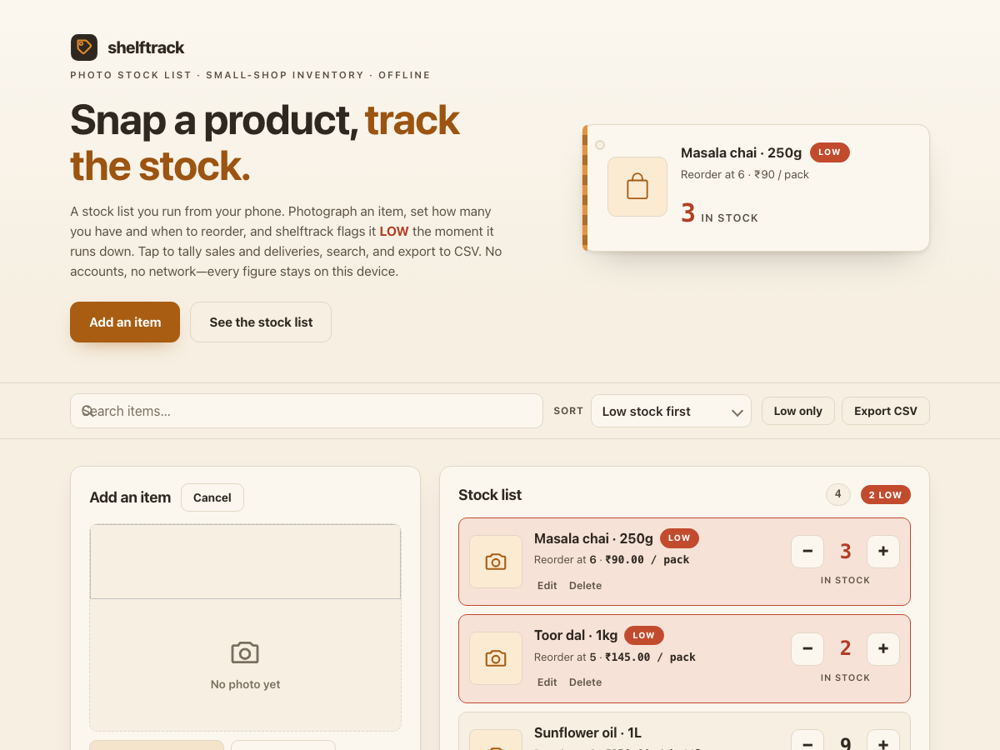

# shelftrack

**Snap a product, track the stock.** A photo-first stock list for a tiny shop. Photograph an item, set how many you have and when to reorder, and shelftrack flags it **LOW** the moment it runs down. Tap to tally sales and deliveries, search, sort low-stock-first, and export the whole list to CSV. 100% client-side, zero dependencies, works fully offline.

## Why

Running a small shop, the stock list lives in your head and on scraps of paper. You only notice the chai is nearly gone when a customer asks for the last packet. Most inventory apps are built for warehouses — accounts, logins, subscriptions, a scanner gun — which is far too much for a counter and a phone.

shelftrack is deliberately small and visual. Add a product with a **photo** (the camera on a phone, a file picker on a desktop), a **quantity**, and a **reorder level** — the point where you'd normally order more. The list shows a thumbnail per item, big **+ / −** buttons to tally stock as things sell or arrive, and a clear **LOW** badge (with an at-a-glance count) the instant an item drops to its reorder level. Sort low-stock-first, search by name, and when it's time to order or hand figures to your accountant, **export the whole list to CSV**. Everything stays on your phone.

## Features

- **Photo per item** — capture with the camera on a phone or pick a file on a desktop. Each image is shrunk to about 320px and stored as a compact JPEG so local storage stays small. Photos are optional; items without one show a neat placeholder tile.
- **LOW at a glance** — an item is flagged the moment its quantity is at or below its reorder level, with a per-item badge and a running "N low" count on the list header. Set the reorder level to 0 to opt an item out of alerts.
- **Fast tallies** — big + / − tap targets adjust stock as you sell or restock; quantity **never drops below zero**, and the minus button disables at zero.
- **Search &amp; sort** — filter by name and sort **low-stock-first**, by name, by quantity, or by recently added. A "Low only" toggle shows just what needs ordering.
- **Price &amp; unit** — optional price (in your chosen currency symbol) and unit per item, shown inline and included in the export.
- **CSV export** — one click writes a standards-compliant (RFC&nbsp;4180) CSV with a UTF-8 BOM, correctly escaping any commas, quotes, or line breaks in your item names so it opens cleanly in any spreadsheet.
- **Storage meter** — a running estimate of how much of the browser's storage budget you've used, with a warning as it fills so photos never surprise you.
- **100% offline** — no accounts, no network calls, no tracking. Everything is saved only in this browser's local storage.

## Quickstart

Just open `index.html` in any modern browser — no build step, no server, no install.

- **Local:** double-click `index.html`, or run a static server in the folder.
- **Hosted:** **[Open shelftrack live](https://sreenivas-sadhu-prabhakara.github.io/shelftrack/)**

Your items, photos, and settings are saved in your browser's local storage, so they persist between visits on the same device. Adding a photo on a phone opens the camera; on a desktop it opens a file picker.

## Privacy

- A strict Content-Security-Policy sets `connect-src 'none'`: the app **cannot** make any network request, even if it tried.
- No external fonts, scripts, images, or analytics. Everything is self-contained in a handful of files.
- Product photos are processed on-device with a `<canvas>` and stored as local `data:` URLs — they are never uploaded anywhere.
- All logic runs in your browser. Nothing about your shop, your prices, or your photos is ever transmitted or stored anywhere but your own device.
- Because there are no network dependencies, it keeps working offline — download it once and it runs with no connection at all.

## Disclaimer

shelftrack is a convenience tool for **keeping a simple visual stock list** in a small shop. It is **not** an accounting, tax, valuation, or point-of-sale system; it does not value your inventory for accounts, handle payments, or replace a physical stocktake, and it is not a substitute for professional advice. The figures it shows are for your own reference — **always count and verify before you order or reconcile**. This software is provided under the MIT License, "as is", without warranty of any kind; the authors accept no liability for any loss, shortage, dispute, or damage arising from its use.

## License

[MIT](./LICENSE) © 2026 Sreenivas Sadhu Prabhakara
